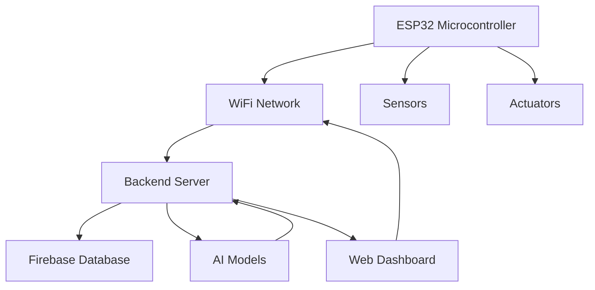

# System Architecture

## Overview

The AI-Powered IoT Indoor Plant Monitoring & Automation System consists of four main components:

1. **ESP32 Firmware** - Collects sensor data and controls actuators
2. **Backend Server** - Processes data, runs AI models, and manages safety logic
3. **AI Models** - Provide predictive analytics and disease detection
4. **Web Dashboard** - Visualizes data and provides user interface

## Component Diagram



## Data Flow

1. **Sensor Data Collection**
   - ESP32 reads soil moisture, temperature, humidity, and light sensors every 10 seconds
   - Data is packaged as JSON and sent via HTTP POST to backend server

2. **Data Processing & AI Analysis**
   - Backend server receives sensor data
   - AI models analyze data for:
     - Health scoring
     - Watering predictions
     - Anomaly detection
   - Results are stored in Firebase

3. **Actuation Decisions**
   - If AI confidence ≥ 85% and safety checks pass:
     - Backend sends actuation commands to ESP32
     - ESP32 activates water pump or grow light

4. **Dashboard Visualization**
   - Web dashboard fetches data from backend
   - Real-time charts and recommendations displayed
   - Users can manually control actuators

## Safety Mechanisms

1. **Pump Safety Timer**
   - Maximum 20-second pump activation
   - Automatic shutoff if exceeded

2. **Watering Interval Limits**
   - Minimum 6-hour interval between waterings
   - Maximum 60 seconds of watering per day

3. **Confidence Threshold**
   - Auto-actuation only if AI confidence ≥ 85%

4. **Watchdog Timer**
   - ESP32 monitors pump operation
   - Emergency shutoff if needed

## Communication Protocols

1. **ESP32 to Backend**
   - HTTP POST requests for sensor data
   - JSON payload format

2. **Backend to ESP32**
   - HTTP response with actuation commands
   - JSON response format

3. **Dashboard to Backend**
   - RESTful API calls
   - JSON request/response format

## Database Schema

### Plant Data Collection
```
plant_data/
  ├── timestamp: number
  ├── sensor_data: object
  │   ├── soil_moisture: number
  │   ├── temperature: number
  │   ├── humidity: number
  │   └── light_intensity: number
  ├── health_score: number
  ├── watering_prediction: object
  │   ├── water_now: boolean
  │   ├── confidence: number
  │   └── next_watering: number
  └── anomaly_detected: boolean
```

### Disease Analysis Collection
```
disease_analysis/
  ├── timestamp: number
  ├── result: object
  │   ├── disease: string
  │   ├── confidence: number
  │   └── treatment: string
```